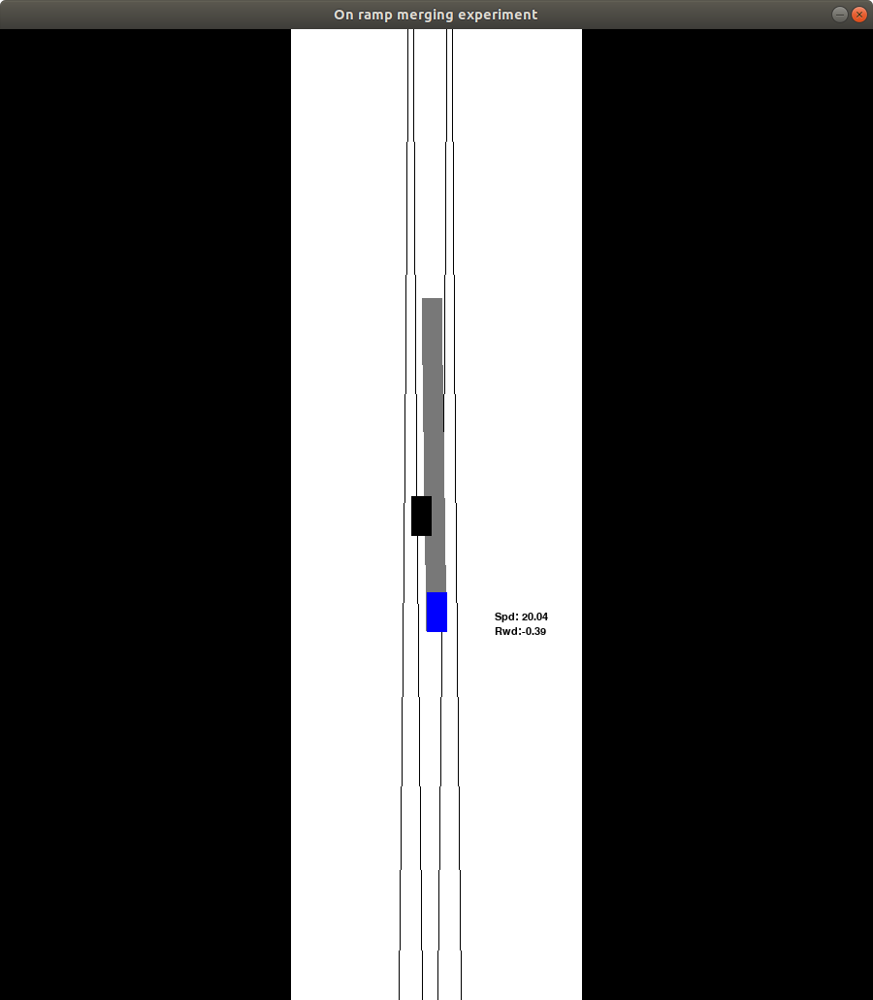
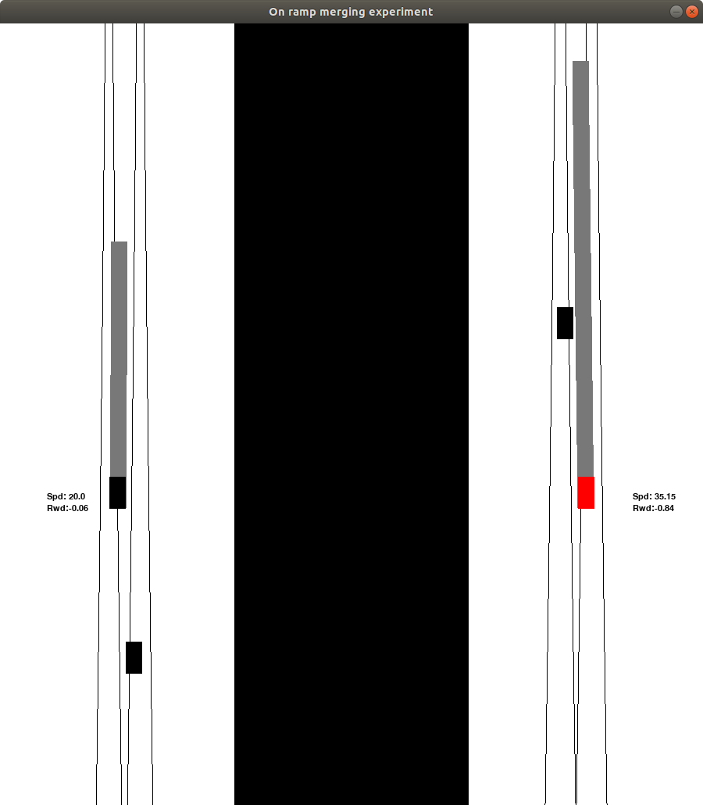

A simple RL-based on-ramp merging scenario simulator. Designed for two-player continuous Decision Making Cognitive Behavior Experiments.

Gym is needed: 
>pip install gym=0.20.0

merging_env in gym: 
> pip install -e .

To train models, set load_path to the model you want, then run the python script. For example:
>load_path=None \
upper = Goal_DQN(load_path)\
lower = HDQN(load_path)

For testing, run "human_player.py". You can set 
> OP_MODEL="pvp" 

so that 2 players are controlled by keyboard. w/s for P1 and Keypad 0/1/2/3/4 actions for P2.

A pretrained model is needed to play with agents. Copy the model files to the folder "scripts/", and set 
> load_path=name_of_the_model 

in human_player.py. Don't forget to specify the network type (e.g. OP_MODEL = "dqn")
